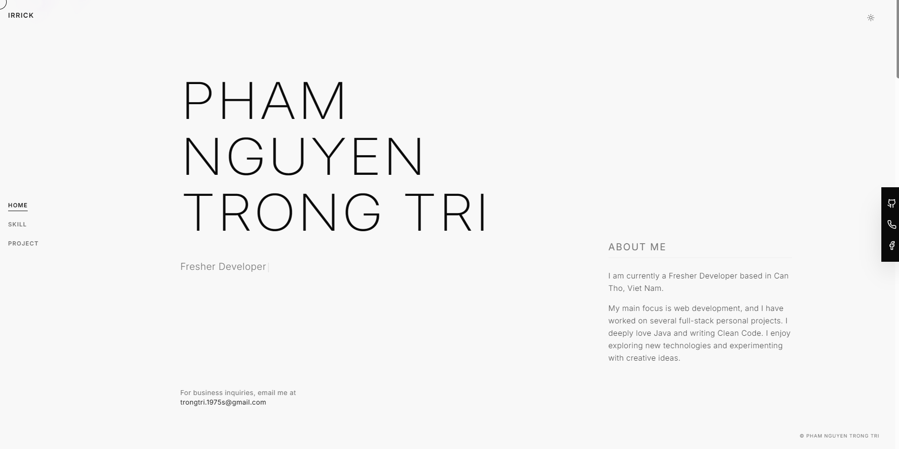

# Pham Nguyen Trong Tri - Developer Portfolio

Welcome to my personal developer portfolio! This project showcases my skills, experience, and the projects I've worked on as a Fresher Developer.

## 📸 Preview

*(Add your sample images here)*


<!--  -->
<!--  -->

## 🛠 Tech Stack

This portfolio is built with modern web technologies:

- **Framework:** [Next.js](https://nextjs.org/) (App Router)
- **Language:** [TypeScript](https://www.typescriptlang.org/)
- **Styling:** [Tailwind CSS](https://tailwindcss.com/)
- **UI Components:** Custom components, Lucide Icons, and various animation libraries (e.g. Framer Motion, Animata)
- **Deployment:** [Vercel](https://vercel.com/)

## 🚀 Getting Started

First, run the development server:

```bash
npm run dev
# or
yarn dev
# or
pnpm dev
# or
bun dev
```

Open [http://localhost:3000](http://localhost:3000) with your browser to see the result.

## 💡 Customization

You can start editing the page by modifying `app/page.tsx`. The page auto-updates as you edit the file.
Metadata and SEO configurations can be found in `app/layout.tsx`.
